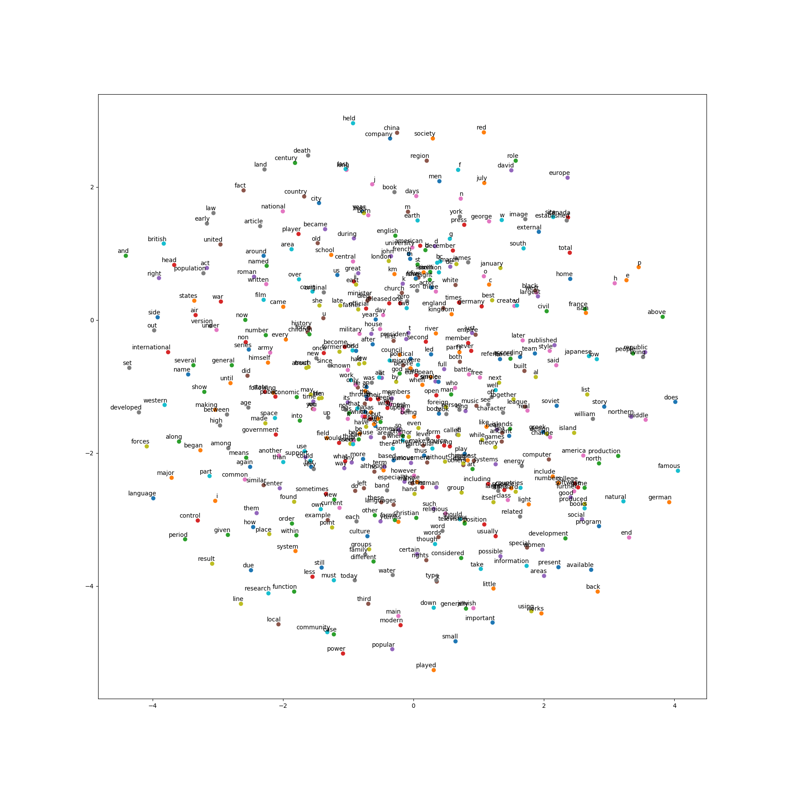

TODO: target log(X_ik) => log(1+X_ik)로 변경하고 다시 실험

# TensorFlow-GloVe
GloVe: Global Vectors for Word Representation

## env
   * TensorFlow 1.4
   * Numpy
   * tqdm
   
## Paper
   * GloVe: Global Vectors for Word Representation: https://nlp.stanford.edu/pubs/glove.pdf
    
## dataset
   * text8: http://mattmahoney.net/dc/text8.zip

## train 135epoch 

## train 100epoch 

## train 5epoch 

